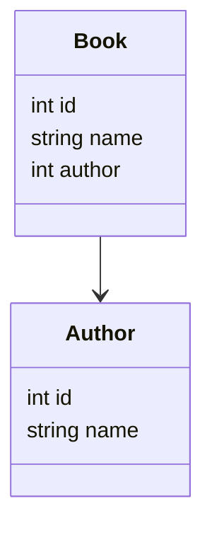

# Exercice 3 : JPA

## Base de données et Spring JPA

### Schéma de données

### Du code

* Ajouter la dépendance de spring jpa (spring-boot-starter-data-jpa) et le driver Postgresql
* Créer le mapping JPA de la classe Book
* Configurer dans application.properties la connexion à la base de données
* Ajouter une nouvelle implémentation de BookService qui utilisera un repository jpa
* Tester ce nouveau repository en le branchant à une base mémoire H2

### Un peu loin
* Ajouter et tester une méthode recherchant les livres à partir de leur titre
* Ajouter et tester une méthode recherchant les livres commençant par un mot